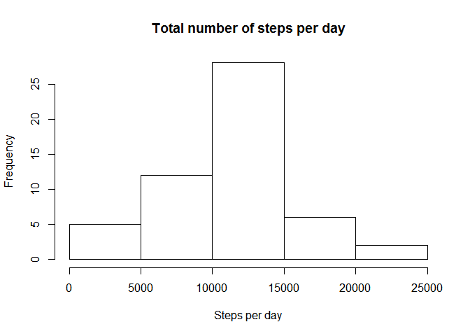
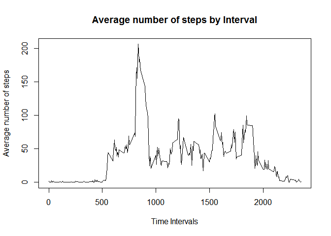
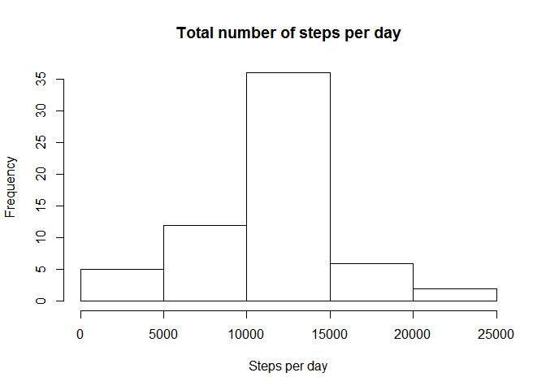
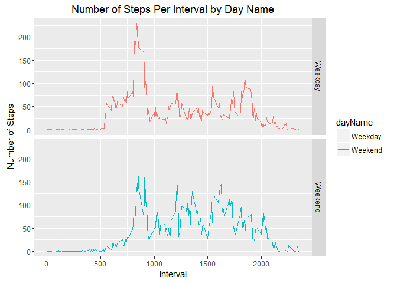

# Reproducible Research: Peer Assessment 1

## Loading and preprocessing the data

```r
library(knitr)
# Clear the workspace
rm(list=ls())
#Download the file and put the file in the data folder
temp <- tempfile()
download.file("http://d396qusza40orc.cloudfront.net/repdata/data/activity.zip",temp)
# Load the raw activity data
activity_data <- read.csv(unz(temp,"activity.csv"))
unlink(temp)
```
## What is mean total number of steps taken per day?

```r
# Compute the total number of steps each day (NA values removed)
sum_data <- aggregate(steps ~ date, activity_data, FUN=sum,na.rm=TRUE)
# Rename the attributes
names(sum_data) <- c("date", "total")
# Display the first few rows
head(sum_data)
```

```
##         date total
## 1 2012-10-02   126
## 2 2012-10-03 11352
## 3 2012-10-04 12116
## 4 2012-10-05 13294
## 5 2012-10-06 15420
## 6 2012-10-07 11015
```

```r
# Histogram of the total number of steps taken each day
hist(sum_data$total, xlab = "Steps per day", main = "Total number of steps per day")
```

<!-- -->

```r
# Mean
mean(sum_data$total)
```

```
## [1] 10766.19
```

```r
# Median
median(sum_data$total)
```

```
## [1] 10765
```
## What is the average daily activity pattern?

```r
# Average steps per %-minut interval for all days
five_minute_interval <- aggregate(steps ~ interval,activity_data, FUN=mean, na.rm=TRUE)
# Plot
plot(five_minute_interval$interval, five_minute_interval$steps, type = 'l', col=1, main="Average number of steps by Interval", xlab="Time Intervals", ylab="Average number of steps")
```

<!-- -->

```r
# 5-minute interval
max_steps <- max(five_minute_interval$steps)
for (i in 1:288) 
{
    if (five_minute_interval$steps[i] == max_steps)
        five_minute_interval_at_max_steps <- five_minute_interval$interval[i]
}
five_minute_interval_at_max_steps 
```

```
## [1] 835
```
## Imputing missing values

```r
# Total number of missing values in the data set
missingValues <- activity_data[!complete.cases(activity_data), ]
nrow(missingValues)
```

```
## [1] 2304
```

```r
# Devise a strategy for filling in all of the missing values in the dataset.
for (i in 1:nrow(activity_data)) {
    if(is.na(activity_data$steps[i])) {
        val <- five_minute_interval$steps[which(five_minute_interval$interval == activity_data$interval[i])]
        activity_data$steps[i] <- val 
    }
}
# New dataset with filled in missing values
new_data_set <- aggregate(steps ~ date, activity_data, sum)
# Histogram of the total number of steps taken each day
hist(new_data_set$steps, main = "Total number of steps per day", xlab = "Steps per day")
```

<!-- -->

```r
# Calculate and report the mean and median total number of steps taken per day.
summary(new_data_set)
```

```
##          date        steps      
##  2012-10-01: 1   Min.   :   41  
##  2012-10-02: 1   1st Qu.: 9819  
##  2012-10-03: 1   Median :10766  
##  2012-10-04: 1   Mean   :10766  
##  2012-10-05: 1   3rd Qu.:12811  
##  2012-10-06: 1   Max.   :21194  
##  (Other)   :55
```
## Are there differences in activity patterns between weekdays and weekends?

```r
# Create a new factor variable in the dataset with two levels -"weekday" and "weekend"
week_day <- function(date_val) {
    wd <- weekdays(as.Date(date_val, '%Y-%m-%d'))
    if  (!(wd == 'Saturday' || wd == 'Sunday')) {
        x <- 'Weekday'
    } else {
        x <- 'Weekend'
    }
    x
}

activity_data$dayName <- as.factor(sapply(activity_data$date, week_day))
# We will use ggplot library
library(ggplot2)
```

```
## Warning: package 'ggplot2' was built under R version 3.2.5
```

```r
new_data_set <- aggregate(steps ~ interval + dayName, activity_data, mean)
# ggplot2
p <- ggplot(new_data_set, aes(interval, steps)) +
     geom_line(stat = "identity", aes(colour = dayName)) +
     theme_gray() +
     facet_grid(dayName ~ ., scales="fixed", space="fixed") +
     labs(x="Interval", y=expression("Number of Steps")) +
     ggtitle("Number of Steps Per Interval by Day Name")
print(p)
```

<!-- -->
